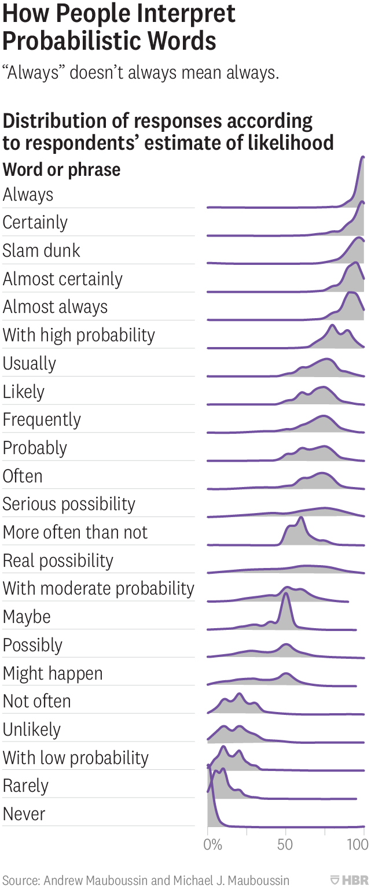

# Probability Survey 
The data and code behind probabilitysurvey.com, a survey on perceptions of probablistic words.

[See our blog post for more details on the data and methodology.](https://hbr.org/2018/07/if-you-say-something-is-likely-how-likely-do-people-think-it-is)

The survey response data is in `probability_surve_results.csv`. 

### Data dictionary

* Gender: M: Male, F: Female, O: Other
* ESL: E: Native english speaker, S: English as a second language
* Age bin contains reported age and each remainig column corresponds to a question in the survey.

